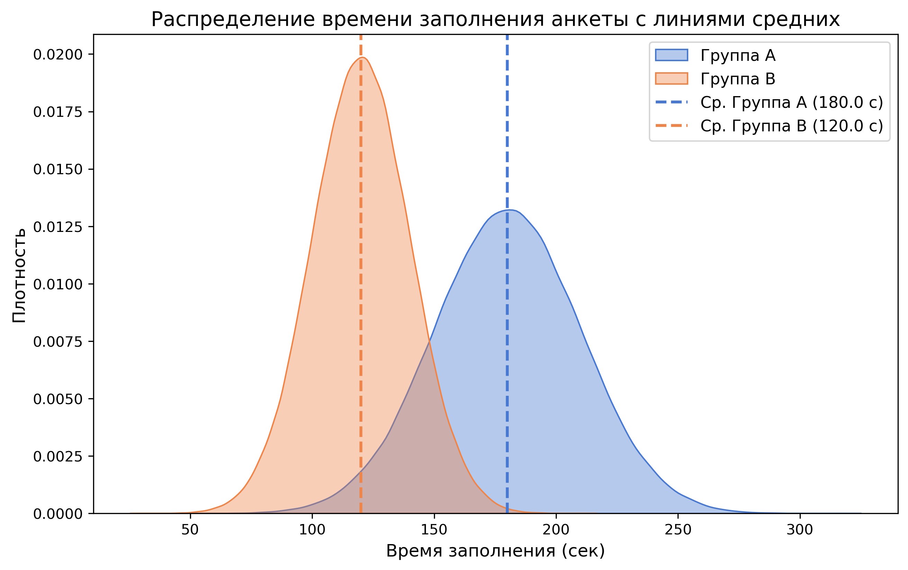
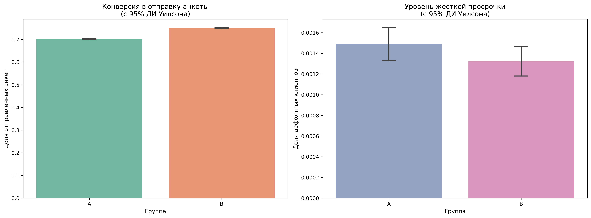

# A/B Test: Оптимизация кредитной анкеты

## Executive Summary (Главные результаты)

* **Бизнес-проблема:** Высокий отток (churn) пользователей на этапе заполнения кредитной анкеты.
* **Итоговое решение:** **Раскатить Вариант B на 100% аудитории.**
* **Бизнес-эффект:**
  * **Время заполнения:** Сократилось на **33%** (со 180 сек до 120 сек, $p < 0.001$, $d = 2.37$).
  * **Конверсия в заявку:** Статистически значимо **выросла** ($p < 0.001$).
  * **Кредитный риск (Guardrail):** Уровень дефолтности остался **стабильным** (0.13% vs 0.14%, $p = 0.153$), качество заемщиков не ухудшилось.

### Метрики эффективности
1. **Primary (Основная метрика):** `time_to_complete` — время заполнения анкеты (в секундах). Цель — сократить время прохождения формы.
2. **Secondary (Вспомогательная метрика):** `is_submitted` — конверсия в успешную отправку анкеты (1 — отправлено, 0 — отток). Цель — увеличить общую конверсию.
3. **Guardrail (Бизнес-ограничение):** `is_bad` — уровень жесткой просрочки (дефолтность). Мы проверяем, что упрощение анкеты не привлекло нецелевых клиентов.

---

## Структура репозитория

* **images/** — папка с графиками для документации
  * `conversion_and_risks.PNG` — конверсия и риски с ДИ Уилсона
  * `time_distribution.PNG` — распределение времени с линиями средних
* **notebooks/** — папка с кодом исследования
  * `credit_form_ab_test.ipynb` — Jupyter Notebook с аналитикой
* `README.md` — главная страница проекта и бизнес-презентация
* `requirements.txt` — список библиотек для запуска проекта

---

## Стек технологий
* **Python** (Pandas, NumPy) — предобработка данных, проверка баланса групп и симуляция.
* **Pingouin** — проведение статистических тестов (Т-тест Уэлча, критерий Хи-квадрат Пирсона).
* **Matplotlib / Seaborn** — профессиональная визуализация распределений и доверительных интервалов.

---

## Результаты исследования

### 1. Анализ времени заполнения анкеты (`time_to_complete`)
* **Метод проверки:** Т-критерий Уэлча (Welch's t-test) для независимых выборок.
* **Результат:** Среднее время заполнения анкеты в тестовой группе B сократилось со **180 до 120 секунд**.
* **Статистическая значимость:** Изменения высокозначимы ($p \approx 0.0$). Размер эффекта по Коэну (Cohen's d) равен **2.37**, что говорит о колоссальном и стабильном сдвиге распределения.

### 2. Анализ конверсии в отправку заявки (`is_submitted`)
* **Метод проверки:** Критерий независимости Хи-квадрат Пирсона ($\chi^2$).
* **Результат:** Доля успешно завершенных анкет в группе B статистически выше.
* **Статистическая значимость:** Разница высокозначима ($p = 3.05 \times 10^{-291}$). Упрощение интерфейса доказало свою эффективность в снижении оттока.

### 3. Анализ кредитных рисков (`is_bad`)
* **Метод проверки:** Критерий независимости Хи-квадрат Пирсона ($\chi^2$).
* **Результат:** Доля дефолтных клиентов в обеих группах колеблется на минимальном уровне (0.14% против 0.13%).
* **Статистическая значимость:** Различия **статистически НЕ значимы** ($p = 0.153$). Упрощение анкеты не ухудшило качество входящего потока.

---

## Итоговое заключение и рекомендации
1. **Интерфейс стал удобнее:** Новый дизайн позволил пользователям проходить регистрацию в среднем на 1 минуту быстрее.
2. **Конверсия выросла:** Мы получили статистически подтвержденный прирост отправленных анкет, что увеличивает поток потенциальных заемщиков.
3. **Безопасность для портфеля:** Быстрое заполнение анкеты не ухудшило качество заемщиков — риски остались стабильными.

**Бизнес-рекомендация:** Эксперимент признан полностью успешным. Продукт готов к **100% раскатке Варианта B** на всю аудиторию.
